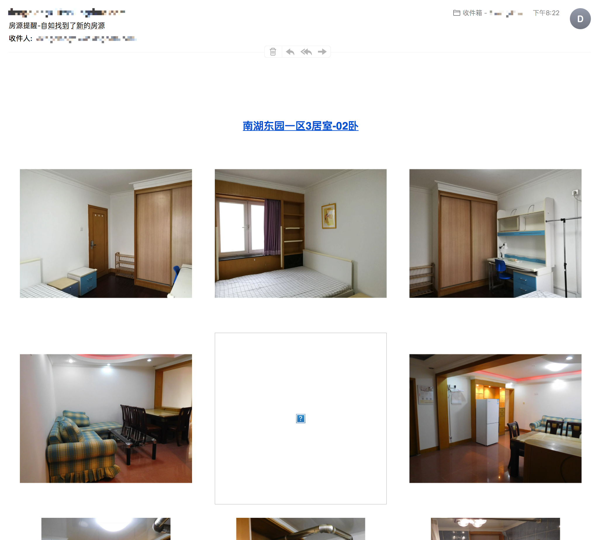
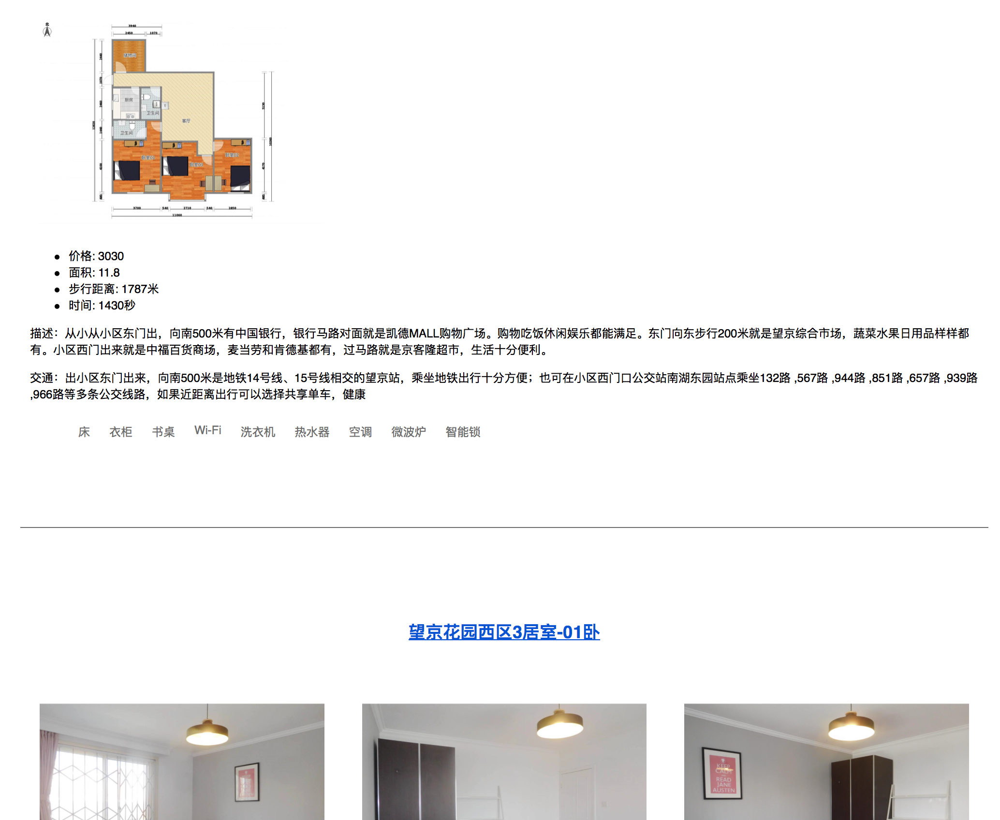

# 自如找房邮件自动通知爬虫

### 简介
    本项目初衷是为满足自己找房需求，通过爬虫程序定期爬取某些房源列表并按照给
    定规则筛选出满足自己需求的房源

### 使用方式
 1. 将configurations.py.bak 重命名问 configurations.py
 2. 配置好configurations.py 邮件相关参数
 3. config中key是高德地图key，可以从开发者平台中获得 地址为[http://lbs.amap.com](http://lbs.amap.com)
    服务平台选择web服务即可
 4. 设置好相关配置项，代码中注释已经足够详细。
 5. 启动 ziroom_spider.py

### 效果如下

